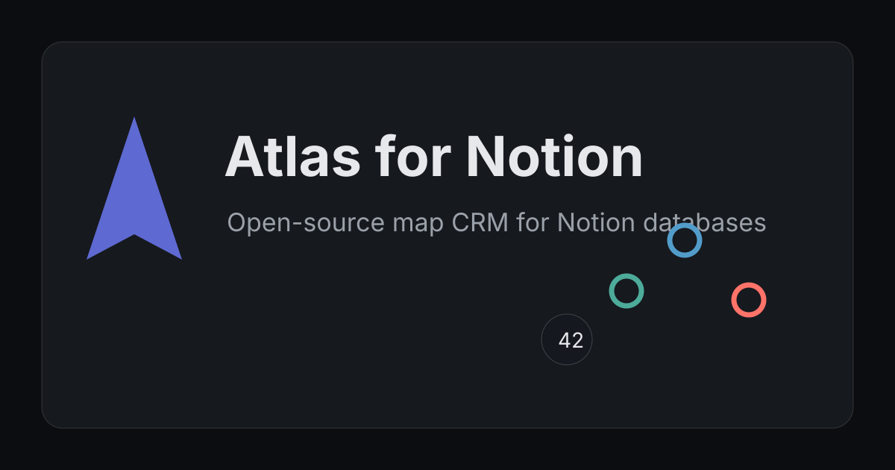

# Atlas for Notion

Atlas is an open-source, map-first CRM for Notion databases. Notion remains the source of truth; Atlas reads an Accounts database and renders every mapped account on a fast MapLibre web app and a Notion-friendly `/embed` route.

[](https://vercel.com/new/clone?repository-url=https://github.com/brycejohnson1417/atlas-for-notion)



## Quickstart

```bash
pnpm i
pnpm dev
```

With zero env vars, Atlas boots to the setup wizard. For the local demo map:

```bash
DEMO_MODE=true EMBED_SHARE_KEY=dev-demo-key pnpm dev
```

Open `http://localhost:3000` or embed `http://localhost:3000/embed?key=dev-demo-key`.

Hosted demo: [https://atlas-for-notion.vercel.app](https://atlas-for-notion.vercel.app)

Guided setup: [https://atlas-for-notion.vercel.app/welcome](https://atlas-for-notion.vercel.app/welcome)

Hosted embed: [https://atlas-for-notion.vercel.app/embed?key=dev-demo-key](https://atlas-for-notion.vercel.app/embed?key=dev-demo-key)

## Set Up In 5 Minutes

1. Duplicate the public Notion template.
2. Create an internal integration at `notion.so/my-integrations`.
3. Share the duplicated Accounts database with that integration.
4. Open `/welcome`, then paste the token into `/setup`.
5. Pick the database, review the suggested fields, and render the map.

## Docker

```bash
docker compose up --build
```

Atlas stores setup state in the `atlas-data` Docker volume.

## Environment

```bash
NOTION_TOKEN=
ACCOUNTS_DATABASE_ID=
EMBED_SHARE_KEY=
MAP_TILE_URL=
GEOCODER=nominatim
GEOCODER_API_KEY=
DEMO_MODE=false
DEMO_NOTION_TOKEN=
```

## Mapping

Atlas stores Notion property IDs internally. Required role: `name`. Use either `address` for geocoding or `latitude` and `longitude` number properties for immediate map rendering. Optional roles include `status`, `segment`, `badges`, `owner`, `phone`, `email`, `website`, `lastTouch`, and `notes`.

See [docs/property-mapping.md](docs/property-mapping.md), [docs/geocoding.md](docs/geocoding.md), [docs/embed.md](docs/embed.md), [docs/troubleshooting.md](docs/troubleshooting.md), [docs/PRD.md](docs/PRD.md), and [docs/HOW-I-BUILT-IT.md](docs/HOW-I-BUILT-IT.md).

## Screenshot Kit

Release screenshot placeholders and capture requirements live in [docs/media](docs/media). The public demo, `/welcome`, `/setup`, and `/embed` routes are the source screens for the gallery.

## Seed

```bash
NOTION_TOKEN=... pnpm seed --parent <page_id>
```

The seed script creates `Accounts — NYC Laptop-Friendly Workspots` with 150 demo rows, status colors, coordinates, amenities, and notes.

## Demo Script

1. Open the hosted demo or run `DEMO_MODE=true EMBED_SHARE_KEY=dev-demo-key pnpm dev`.
2. Search with Cmd-K for `Housing Works Bookstore Cafe`.
3. Toggle status chips and watch the map/list update together.
4. Open `/embed?key=dev-demo-key&legend=false` to show the chrome-less Notion embed.
5. Run `POST /api/refresh?key=dev-demo-key` after changing Notion data in a live demo workspace.

## API

- `GET /api/data`
- `POST /api/refresh?key=...`
- `POST /api/setup/validate-token`
- `POST /api/setup`
- `POST /api/write`
- `GET /embed?key=...`

## Release Checks

```bash
pnpm check
pnpm perf
pnpm availability
```

`pnpm perf` writes Lighthouse evidence to `reports/lighthouse-mobile.json`. `pnpm availability` writes npm/GitHub/domain availability evidence to `reports/availability.txt`.

See [docs/release-verification.md](docs/release-verification.md) for the latest local release evidence and environment-dependent checks.

## Roadmap

- Durable setup storage via filesystem and Vercel KV.
- Geocode provider queue and cache write-through.
- Notion OAuth public integration.
- Write-back status changes and activity notes.
- Route planning, territories, heatmaps, saved map lenses, PWA offline mode.

## License

MIT
